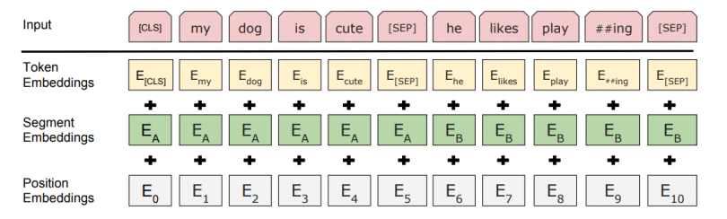

# Greek BERT model for Text Classification downstream task

This repository contains Colaboratory notebooks where you can observe the use of the BERT model for Text classification.

## Why was BERT needed?

One of the biggest challenges in NLP is the lack of enough training data. Overall there is enormous amount of text data available, but if we want to create task-specific datasets, we need to split that pile into the very many diverse fields. And when we do this, we end up with only a few thousand or a few hundred thousand human-labeled training examples. Unfortunately, in order to perform well, deep learning based NLP models require much larger amounts of data — they see major improvements when trained on millions, or billions, of annotated training examples. To help bridge this gap in data, researchers have developed various techniques for training general purpose language representation models using the enormous piles of unannotated text on the web (this is known as pre-training). These general purpose pre-trained models can then be fine-tuned on smaller task-specific datasets, e.g., when working with problems like question answering and sentiment analysis. This approach results in great accuracy improvements compared to training on the smaller task-specific datasets from scratch. BERT is a recent addition to these techniques for NLP pre-training; it caused a stir in the deep learning community because it presented state-of-the-art results in a wide variety of NLP tasks, like question answering.

## What is BERT?

BERT is a method of pre-training language representations, meaning that we train a general-purpose "language understanding" model on a large text corpus (like Wikipedia), and then use that model for downstream NLP tasks that we care about (like text classification). BERT outperforms previous methods because it is the first unsupervised, deeply bidirectional system for pre-training NLP.

Unsupervised means that BERT was trained using only a plain text corpus, which is important because an enormous amount of plain text data is publicly available on the web in many languages.

BERT was built upon recent work in pre-training contextual representations. Contextual models generate a representation of each word that is based on the other words in the sentence. For example, in the sentence `I made a bank deposit` BERT represents "bank" using both its left and right context — `I made a ... deposit` — starting from the very bottom of a deep neural network, so it is deeply bidirectional. BERT uses a simple approach for this: We mask out 15% of the words in the input, run the entire sequence through a deep bidirectional [Transformer encoder](https://arxiv.org/abs/1706.03762), and then predict only the masked words.

## How does it work?

BERT relies on a Transformer (the attention mechanism that learns contextual relationships between words in a text). A basic Transformer consists of an encoder to read the text input and a decoder to produce a prediction for the task. Since BERT’s goal is to generate a language representation model, it only needs the encoder part. The input to the encoder for BERT is a sequence of tokens, which are first converted into vectors and then processed in the neural network. But before processing can start, BERT needs the input to be massaged and decorated with some extra metadata:

- **Token embeddings**: A [CLS] token is added to the input word tokens at the beginning of the first sentence and a [SEP] token is inserted at the end of each sentence.
- **Segment embeddings**: A marker indicating Sentence A or Sentence B is added to each token. This allows the encoder to distinguish between sentences.
- **Positional embeddings**: A positional embedding is added to each token to indicate its position in the sentence.

Essentially, the Transformer stacks a layer that maps sequences to sequences, so the output is also a sequence of vectors with a 1:1 correspondence between input and output tokens at the same index.

## Large variety of models

You can find implementations at the original [Google's repository](https://github.com/google-research/bert) and at the [Hugging Face web site](https://huggingface.co/transformers/index.html) with 8 architectures with over 30 pretrained models, some in more than 100 languages. You can apply your own dataset inside the colab notebook.

## Acknowledgement
The model that has been used inside these colab notebooks has been downloaded from [this](https://huggingface.co/nlpaueb/bert-base-greek-uncased-v1) web link. You can also view more details about the generation of the model at the official github [repository](https://github.com/nlpaueb/greek-bert) and the [web site](http://nlp.cs.aueb.gr/software.html).

The dataset was kindly provided by [Dimosthenis Beleveslis](https://github.com/dimosbele) of the The Data Mining and Analytics Research Group School of Science & Technology, International Hellenic University Thessaloniki, Greece and has also been used at [this](https://www.ihu.edu.gr/tjortjis/A%20Hybrid%20Method%20for%20Sentiment%20Analysis%20of%20Election%20Related%20Tweets.pdf) paper.

There is also a offensive/not offensive dataset on the dataset folder which was downloaded from [this site](https://zpitenis.com/resources/ogtd/)

